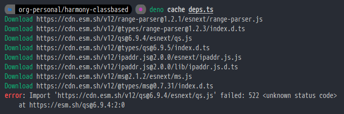

# depno.land
> i'm korean. not good at english. so if you find any grammar mistakes, plz open issue(or pull request)

## introduction
when i was initalizing deno project\
i saw this shi**y thing

so, we made this,\
the **deep cached dependancy mirror**

## features
as you know, many modules are requesting their dependancies from many web servers (like githubusercontent, cdn.esm.sh, deno.land...)

it's okay when all of deps servers works.\
but if one of these web servers dead and you don't have any cache, \*hell gate opens\*

so we trying to make following features:
### deep caching
you can request caching with our website.\
automated system will be scan requested code, check dependancies and download all of dependancies(recursively).

### deps url injection
when it finished deep caching, we inject code's dependancies url to our mirror url.\
so if you import our cached module, deno will be use one web server(our mirror)

### automated documentation
yea we know, "doc.deno.land" is not good\
maybe we can make better automated-docs site

## license
Copyright 2020 depno-land collaborators.\
See [LICENCE](LICENSE) to more infomation.
